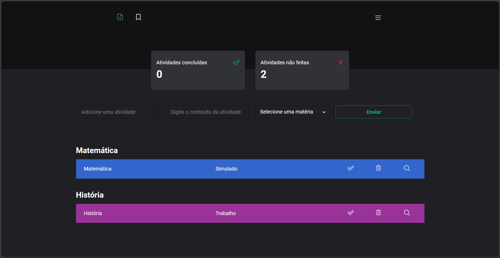

<h1 align='center'>
    Agenda
    <br />
    <br />
    
</h1>
<br />

## 🎯 Objetivo
Este projeto foi desenvolvido com objetivo de auxiliar na organização de tarefas escolares, permitindo ao usuário adicionar, editar e remover tarefas de forma rápida e eficaz.

## 🧪 Tecnologias
A [agenda](https://planner-pdd.vercel.app) foi desenvolvida com as seguintes tecnologias:

- [React](https://react.dev/)
- [Typescript](https://www.typescriptlang.org/)
- [Firebase](https://firebase.google.com/)

## Como executar
Para executar ou modificar o projeto por conta própria basta:

```bash
# Fazer o clone do projeto
$ git clone https://github.com/pdanmt/Planner

# Entrar na pasta criada
$ cd Planner
```
Para inicializar o projeto utilize o npm:
```bash
# Instale as dependências
$ npm i

# Inicialize
$ npm run dev
```
A aplicação estará rondando no endereço http://localhost:5173/

Além disso, será necessário que você crie um projeto firebase, utilizando do firebase firestore e authentication. Após isso, crie um arquivo .env.local ou .env na raiz do projeto e coloque as configurações do firebase, deste jeito:

```dotenv
VITE_API_KEY=<SUA_CHAVE>
VITE_AUTH_DOMAIN=<SEU_DOMÍNIO_DE_AUTENTICAÇÃO>
VITE_DATABASE_URL=<A_URL_DO_SEU_BANCO_DE_DADOS>
VITE_PROJECT_ID=<O_ID_DO_SEU_PROJETO>
VITE_STORAGE_BUCKET=<SEU_STORAGE_BUCKET>
VITE_MESSAGING_SENDER_ID=<SEU_MESSAGING_SENDER_ID>
VITE_APP_ID=<O_ID_DA_SUA_APLICAÇÃO>
```

## 📝 Layout
O design da agenda foi inspirado no projeto da [Rocketseat](https://www.rocketseat.com.br/) DT Money, e pode ser acessado pelo link a seguir.

[Figma do projeto](https://www.figma.com/community/file/1138814493269096792)